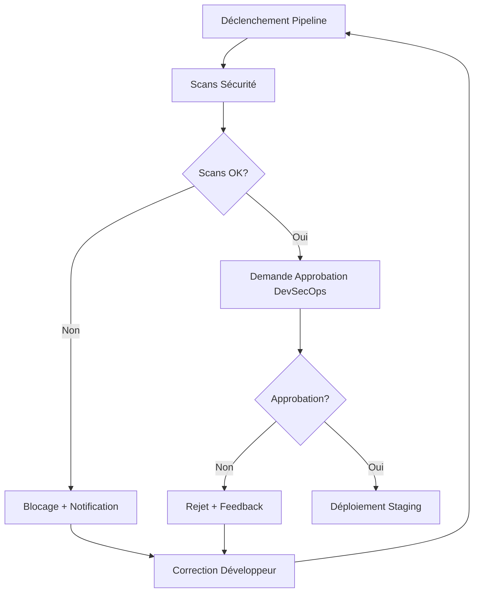
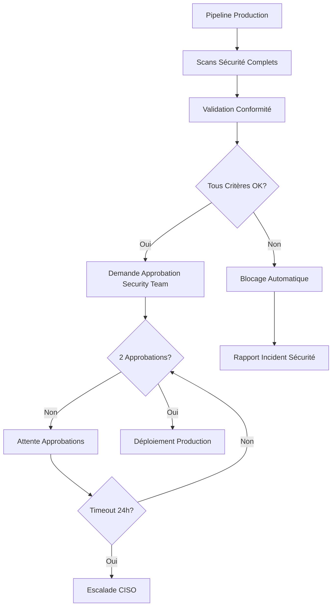

# Processus d'Approbation Sécurisée - DevSecOps

## 🎯 Vue d'Ensemble des Processus d'Approbation

Les processus d'approbation implémentent une gouvernance progressive basée sur le risque et l'environnement cible, garantissant que chaque déploiement respecte les standards de sécurité appropriés.

## 🔒 Matrice d'Autorité par Environnement

### Development Environment
- **Approbation**: Automatique
- **Critères**: Scans sécurité en mode warning
- **SLA**: Immédiat
- **Escalade**: Aucune

### Staging Environment  
- **Approbation**: DevSecOps Engineer (1 personne)
- **Critères**: Scans sécurité passés + couverture code
- **SLA**: < 4 heures
- **Escalade**: Security Architect après 4h

### Production Environment
- **Approbation**: Security Team (2 personnes minimum)
- **Critères**: Conformité complète + validation risques
- **SLA**: < 24 heures
- **Escalade**: CISO après 24h

## 🔄 Workflows d'Approbation Détaillés

### Workflow 1: Approbation DevSecOps (Staging)



**Configuration Template:**
```yaml
approval_devsecops:
  name: "DevSecOps Security Review"
  identifier: devsecops_approval
  type: HarnessApproval
  spec:
    approvers:
      minimumCount: 1
      userGroups:
        - org.DevSecOps_Team
    approvalMessage: |
      🔒 **DevSecOps Security Review Required**
      =====================================
      
      📋 **Application Details**
      - Service: <+service.name>
      - Environment: Staging
      - Version: <+artifacts.primary.tag>
      - Branch: <+codebase.branch>
      
      ✅ **Security Validation Status**
      - Source Code Scan: PASSED
      - Container Image Scan: PASSED  
      - Code Coverage: <+pipeline.variables.coverage>%
      - Vulnerability Threshold: Medium
      
      📊 **Risk Assessment**
      - Risk Level: LOW-MEDIUM
      - Security Score: <+pipeline.variables.security_score>/100
      - Compliance Status: STAGING_READY
      
      🎯 **Review Checklist**
      - [ ] Security scan results reviewed
      - [ ] No critical vulnerabilities present
      - [ ] Code coverage meets requirements
      - [ ] Architecture changes assessed
      
      **Please approve if security requirements are met.**
      
    rejectionMessage: |
      ❌ **DevSecOps Review - REJECTED**
      
      Security requirements not satisfied.
      
      **Next Steps:**
      1. Review security scan findings
      2. Address identified vulnerabilities  
      3. Ensure code coverage compliance
      4. Resubmit for approval
      
      📞 Contact: devsecops-team@company.com
      
    timeout: 4h
    
  # Actions automatiques
  failureStrategies:
    - onFailure:
        errors:
          - Timeout
        action:
          type: StageRollback
    - onFailure:  
        errors:
          - ApprovalRejection
        action:
          type: Abort
          
  # Notifications
  notifications:
    - name: approval_request
      type: Email
      recipients:
        - org.DevSecOps_Team
      template: |
        Subject: 🔒 DevSecOps Approval Required - <+service.name>
        
        A staging deployment requires your security review and approval.
        
        Pipeline: <+pipeline.name>
        Application: <+service.name>
        
        Review URL: <+pipeline.executionUrl>
    
    - name: approval_timeout
      type: Slack
      webhook: <+secrets.getValue("slack_devsecops_webhook")>
      template: |
        ⚠️ **APPROVAL TIMEOUT - Action Required**
        
        Pipeline: <+pipeline.name>
        Approval pending for: 4+ hours
        
        Please review: <+pipeline.executionUrl>
```

### Workflow 2: Approbation Security Team (Production)



**Configuration Template:**
```yaml
approval_security_team:
  name: "Security Team Production Approval"
  identifier: security_team_approval  
  type: HarnessApproval
  spec:
    approvers:
      minimumCount: 2  # Double validation obligatoire
      userGroups:
        - org.Security_Team
        - org.DevSecOps_Team
        - org.Security_Architects
      disallowPipelineExecutor: true  # L'exécuteur ne peut pas s'auto-approuver
      
    approvalMessage: |
      🚨 **PRODUCTION SECURITY APPROVAL REQUIRED**
      ===========================================
      
      🏢 **Enterprise Deployment Review**
      - Application: <+service.name>
      - Environment: **PRODUCTION**
      - Security Level: ENTERPRISE_HARDENED
      - Deployment Window: <+pipeline.variables.deployment_window>
      
      🛡️ **Security Validation Summary**
      ===================================
      ✅ Source Code Security: PASSED (v0.3)
      ✅ Container Image Security: PASSED (v0.3)
      ✅ Infrastructure Security: VALIDATED
      ✅ Secrets Management: COMPLIANT
      ✅ Network Security: CONFIGURED
      
      📋 **Compliance Framework Status**
      ==================================
      ✅ SOX Compliance: VALIDATED
      ✅ GDPR Compliance: VALIDATED  
      ✅ CIS Controls: IMPLEMENTED
      ✅ NIST Framework: COMPLIANT
      
      📊 **Risk Assessment Results**
      =============================
      - Overall Risk Level: <+pipeline.variables.risk_level>
      - Security Score: <+pipeline.variables.security_score>/100
      - Vulnerability Count: <+pipeline.variables.vuln_count>
      - Critical Issues: <+pipeline.variables.critical_issues>
      
      🎯 **Production Readiness Checklist**
      ====================================
      - [ ] All security scans passed with zero tolerance
      - [ ] Compliance requirements fully satisfied
      - [ ] Emergency rollback procedure confirmed
      - [ ] Monitoring and alerting configured
      - [ ] Security incident response plan ready
      - [ ] Change advisory board approval (if required)
      
      ⚠️ **CRITICAL REQUIREMENTS**
      - Minimum 2 approvals from Security Team
      - Zero critical or high vulnerabilities
      - Full audit trail maintained
      - Emergency contact list updated
      
      **🔒 By approving, you certify that this deployment meets all enterprise security standards.**
      
    rejectionMessage: |
      ❌ **PRODUCTION DEPLOYMENT - REJECTED**
      ======================================
      
      **Security requirements not satisfied for production deployment.**
      
      🚨 **Immediate Actions Required:**
      1. Review security scan detailed reports
      2. Address all identified vulnerabilities  
      3. Ensure full compliance validation
      4. Update security documentation
      5. Re-engage Security Team for review
      
      📞 **Emergency Contacts:**
      - Security Team: security-team@company.com
      - Security Architect: security-arch@company.com
      - CISO Office: ciso-office@company.com
      
      🔗 **Resources:**
      - Security Standards: https://wiki.company.com/security
      - Incident Response: https://wiki.company.com/incident
      
    timeout: 24h
    
    # Critères d'approbation avancés
    approvalCriteria:
      conditions:
        - name: zero_critical_vulnerabilities
          expression: <+pipeline.variables.critical_vulns> == 0
        - name: security_score_threshold  
          expression: <+pipeline.variables.security_score> >= 95
        - name: compliance_complete
          expression: <+pipeline.variables.compliance_score> == 100
          
  # Stratégies d'échec et escalade
  failureStrategies:
    - onFailure:
        errors:
          - Timeout
        action:
          type: Custom
          spec:
            script: |
              # Escalade automatique au CISO après timeout
              curl -X POST "<+secrets.getValue('ciso_alert_webhook')>" \
                -H "Content-Type: application/json" \
                -d '{
                  "alert": "PRODUCTION_APPROVAL_TIMEOUT",
                  "pipeline": "<+pipeline.name>",
                  "service": "<+service.name>", 
                  "timeout_duration": "24h",
                  "action_required": "CISO_INTERVENTION"
                }'
              
              echo "🚨 CISO escalation triggered due to approval timeout"
              exit 1  # Bloquer le pipeline
              
  # Notifications multi-canal
  notifications:
    - name: approval_request_email
      type: Email
      recipients:
        - org.Security_Team
        - org.Security_Architects
        - ciso@company.com
      template: |
        Subject: 🚨 URGENT: Production Security Approval Required - <+service.name>
        
        PRODUCTION DEPLOYMENT AWAITING SECURITY APPROVAL
        ===============================================
        
        Application: <+service.name>
        Security Score: <+pipeline.variables.security_score>/100
        Risk Level: <+pipeline.variables.risk_level>
        
        THIS IS A PRODUCTION DEPLOYMENT REQUIRING IMMEDIATE ATTENTION
        
        Review and approve: <+pipeline.executionUrl>
        
        Security Team: 2 approvals required
        SLA: 24 hours maximum
        
    - name: approval_request_slack
      type: Slack  
      webhook: <+secrets.getValue("slack_security_webhook")>
      template: |
        🚨 **PRODUCTION SECURITY APPROVAL**
        
        🏢 Application: *<+service.name>*
        📊 Security Score: *<+pipeline.variables.security_score>/100*
        ⚠️ Risk Level: *<+pipeline.variables.risk_level>*
        
        👥 Required: 2 Security Team approvals
        ⏱️ SLA: 24 hours
        
        <+pipeline.executionUrl>|Review Pipeline>
        
    - name: approval_escalation
      type: PagerDuty
      spec:
        integrationKey: <+secrets.getValue("pagerduty_security_key")>
        severity: high
      condition: <+pipeline.executionTime> > 12h  # Escalade après 12h
      template: |
        PRODUCTION SECURITY APPROVAL OVERDUE
        
        Pipeline: <+pipeline.name>
        Service: <+service.name>
        Overdue: 12+ hours
        
        Immediate Security Team intervention required.
```

## 📊 Métriques et Monitoring des Approbations

### KPIs d'Approbation
```yaml
approval_metrics:
  sla_compliance:
    dev: "N/A (Auto)"
    staging: "< 4h (95% target)"
    production: "< 24h (98% target)"
    
  approval_rates:
    first_time_approval: "> 80%"
    rejection_rate: "< 15%"
    timeout_rate: "< 5%"
    
  escalation_metrics:
    devsecops_escalations: "< 2 per month"
    ciso_escalations: "< 1 per quarter"
    emergency_overrides: "< 1 per year"
```

### Dashboard de Monitoring
```yaml
approval_dashboard:
  widgets:
    - name: "Pending Approvals"
      type: count
      filter: status == "waiting_for_approval"
      
    - name: "Approval SLA Status"  
      type: gauge
      metric: avg_approval_time
      thresholds:
        green: "< 2h"
        yellow: "2-6h"
        red: "> 6h"
        
    - name: "Rejection Reasons"
      type: pie_chart
      dimensions:
        - security_vulnerabilities
        - compliance_issues
        - insufficient_testing
        - architecture_concerns
```

## 🚨 Processus d'Escalade d'Urgence

### Niveau 1: Escalade DevSecOps (4h staging)
```yaml
escalation_level_1:
  trigger: staging_approval_timeout > 4h
  actions:
    - notify: security_architect
    - create_ticket: jira_urgent
    - schedule_meeting: security_review_call
```

### Niveau 2: Escalade CISO (24h production)  
```yaml
escalation_level_2:
  trigger: production_approval_timeout > 24h
  actions:
    - notify: ciso_office
    - create_incident: severity_high
    - activate: emergency_response_team
    - document: escalation_report
```

### Override d'Urgence (Break Glass)
```yaml
emergency_override:
  triggers:
    - critical_security_incident
    - business_continuity_threat
    - regulatory_deadline
    
  process:
    1. ciso_authorization_required: true
    2. business_justification: mandatory
    3. risk_acceptance: documented
    4. post_deployment_review: scheduled
    5. audit_trail: complete
    
  approvers:
    - ciso: required
    - business_owner: required  
    - security_architect: required
    
  notifications:
    - board_notification: immediate
    - audit_committee: within_24h
    - regulators: if_required
```

## 🔧 Configuration Avancée

### Groupes d'Approbateurs par Spécialité
```yaml
approver_groups:
  devsecops_engineers:
    members:
      - john.doe@company.com
      - jane.smith@company.com
    specialties:
      - container_security
      - pipeline_security
      
  security_architects:
    members:
      - alice.wilson@company.com
      - bob.johnson@company.com
    specialties:
      - enterprise_architecture
      - compliance_frameworks
      
  security_team:
    members:
      - security-lead@company.com
      - security-senior@company.com
    specialties:
      - threat_analysis
      - incident_response
```

### Conditions d'Approbation Dynamiques
```yaml
dynamic_approval_conditions:
  - name: high_risk_deployment
    condition: <+pipeline.variables.risk_score> > 7
    additional_approvers:
      - org.Security_Architects
      
  - name: compliance_sensitive
    condition: <+pipeline.variables.compliance_frameworks>.contains("SOX")
    additional_approvers:
      - org.Compliance_Team
      
  - name: weekend_deployment
    condition: dayOfWeek() in ["Saturday", "Sunday"]
    additional_approvers:
      - org.On_Call_Security
```

Ce processus d'approbation garantit une gouvernance rigoureuse tout en maintenant l'agilité nécessaire au cycle de développement moderne.